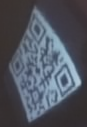
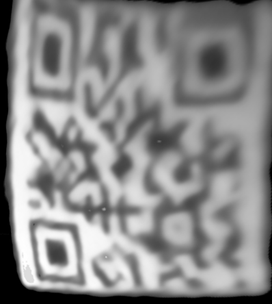
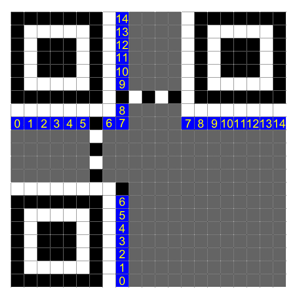
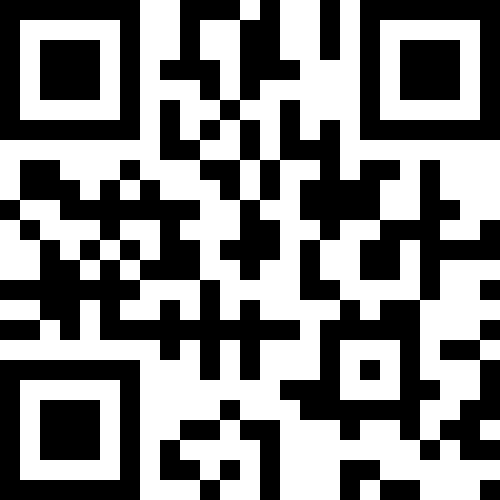
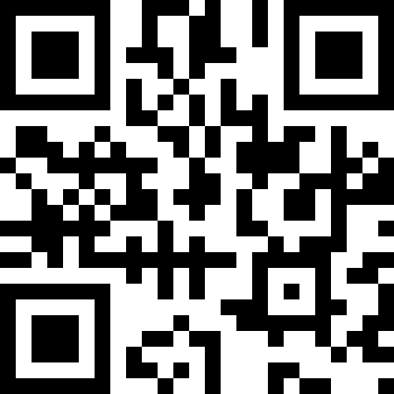

# Plaid CTF 2018 - Task "Messy Desk"

## Extracting the QR code

In this task we are given a fragment of video from a surveillance camera,
pointing to a messy desk. The only interesting thing in the video is a
reflection of a QR code on the glass/plastic surface of a sphere. It's a
curved and quite small reflection, less than 100 pixels wide, as you can
see here in a crop of a video frame in its original resolution:



After flipping, scaling and transforming it into a (more or less) square,
this is what we got:



Not very promising... Obviously, this wouldn't be detected by any QR code
reader, so we decided to manually build a new QR code from the scratch
based on it, but with enough quality to be parsed by readers.

## Manually building the QR code

Of course the main problem is determining which pixels are black and white
on the original image, as the resolution is very low, especially on the
bottom right corner. But looking carefully we can tell many pixels apart,
mostly those that are alone or forming a line (while those forming a cluster
are more difficult to separate). Thanks to this, we can infer it's a version
2 QR (25x25).

We also have information about how all QR codes are formatted. Thanks to
the excellent [QR code tutorial at Thonky.com](https://www.thonky.com/qr-code-tutorial/),
(from where the next two images have been taken), we can fix the position
of some pixels, helping also to fix other pixels in the vicinity:


But especially important is the format string, a 15-bit length sequence
(5 bit of data + 10 bit for error correction) that determines the error
correction level for the QR code and the applied mask pattern:



Looking at the [table of possible values](https://www.thonky.com/qr-code-tutorial/format-version-tables),
for the format string we can quickly see that the best matching
sequence is 011000001101000, corresponding to ECC level Q (that
allows to recover 25% of data, very useful for this problem), and
the pattern mask 1 (there are several masks that help QR codes to
be easier to read)

All of this lead to our first version of the reconstructed
QR code:



But it didn't work :D  In spite of several attempts with small changes
to some doubtful bits, no QR code reader would consider it valid.

## Fixing the QR code to make it work

What else could we do? From the analysis of the format string
we learnt that the QR code uses pattern mask 1, meaning that
even rows are inverted.

Thanks again to the QR tutorial we could learn [how bits are placed](https://www.thonky.com/qr-code-tutorial/module-placement-matrix)
in a QR code, and applying the pattern mask we could decode
the first two columns, obtaining this:

```
0100 meaning data is in byte format
00010010 the code has 18 characters (it's actually 19)
01010100 T
01000010 B
11000100 D (assuming first bit is incorrect)
01000110 F
00111011 ;
01111010 z
00110000 0
```

`TBDF;z0`? What a crappy way to start a flag... But we have to take into
account that the code starts from the bottom right corner, where resolution
is lower and it's easier to make a mistake.

But thankfully we knew that all flags begin with "PCTF{", so we
could just fix the pixels to match this sequence. It was not
a big deal, as only 5 pixels were affected. This is the result:



The plan was to go on and verify if the remaining characters of the flag
kept making sense, but... it worked!!!  QR code readers would read the
full flag from that QR code:

`PCTF{z0oo0m_nh4nc3}`

Probably there were some more bits that were wrong in the
remaining QR code, but the error correction bits were now enough
for the QR readers to completely rebuild the original message, so
there was no need to recover perfectly the original QR code.
